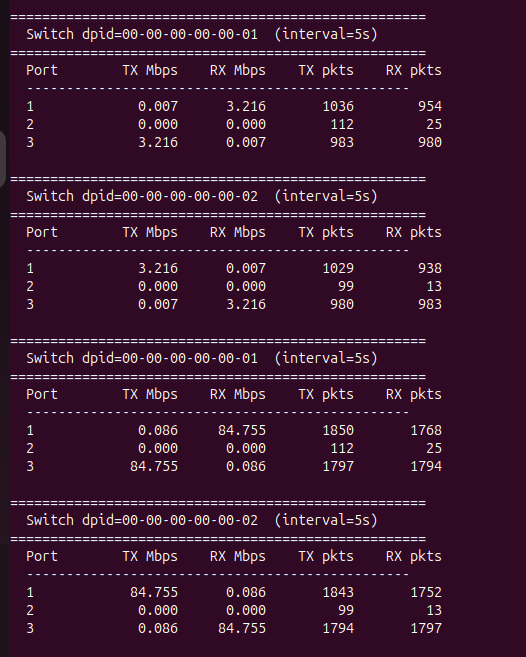
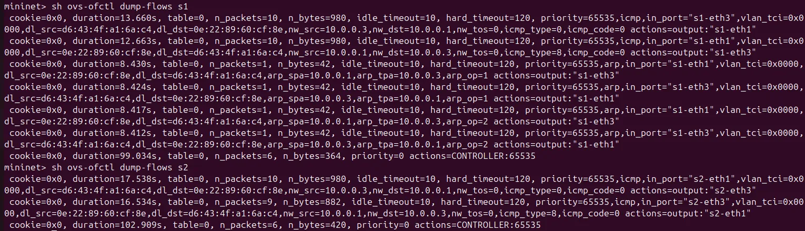

# SDN Network Utilization Monitor

An SDN-based network utilization monitor built with **Mininet** and the **POX** OpenFlow controller. Demonstrates controller–switch interaction, MAC learning, flow rule installation, and real-time per-port bandwidth monitoring.

---

### Name: Shaurya Singh
### SRN: PES1UG24CS437

## Problem Statement

Traditional networks lack visibility into per-link utilization at the control plane level. This project implements an SDN solution where a centralized POX controller:

- Learns MAC addresses dynamically and installs flow rules on the switch
- Polls every connected switch for port-level statistics every 5 seconds
- Displays real-time TX/RX throughput (Mbps) and packet counts per port

---

## Topology

```
h1 (10.0.0.1) ──┐              ┌── h3 (10.0.0.3)
                 s1 ── trunk ── s2
h2 (10.0.0.2) ──┘              └── h4 (10.0.0.4)

Controller: POX @ 127.0.0.1:6633
```

Two OVS switches connected via a trunk link, each with two hosts. All links run at 100 Mbps.

---

## Setup & Execution

### Prerequisites

```bash
# Mininet
sudo apt install mininet

# POX
git clone https://github.com/noxrepo/pox.git
cd pox
git checkout eel
```

### Install the controller

```bash
cp monitor_controller.py ~/pox/ext/
```

### Run

**Terminal 1 — Start POX controller:**
```bash
cd ~/pox
./pox.py monitor_controller
```

**Terminal 2 — Start Mininet topology:**
```bash
sudo python3 topology.py
```

---

## Test Scenarios

### Scenario A — ICMP Forwarding (ping)

```
mininet> h1 ping h3 -c 10
```

Expected: 0% packet loss. First ping has higher latency (~100ms) as the controller learns the MAC and installs flow rules. Subsequent pings drop to <1ms as packets are forwarded directly by the switch.

### Scenario B — TCP Throughput (iperf)

```
mininet> iperf h1 h3
```

Expected: ~80–90 Mbps sustained throughput. The POX terminal shows TX/RX Mbps jumping on the trunk-facing ports of both s1 and s2.

---

## Proof of Execution

### Scenario A — Ping (h1 → h3)


### Scenario B — iperf (h1 → h3)



### Flow Tables (s1 and s2)



---


## References

- [POX Documentation](https://noxrepo.github.io/pox-doc/html/)
- [Mininet Walkthrough](http://mininet.org/walkthrough/)
- [OpenFlow 1.0 Specification](https://opennetworking.org/wp-content/uploads/2013/04/openflow-spec-v1.0.0.pdf)
- Kurose & Ross, *Computer Networking: A Top-Down Approach*